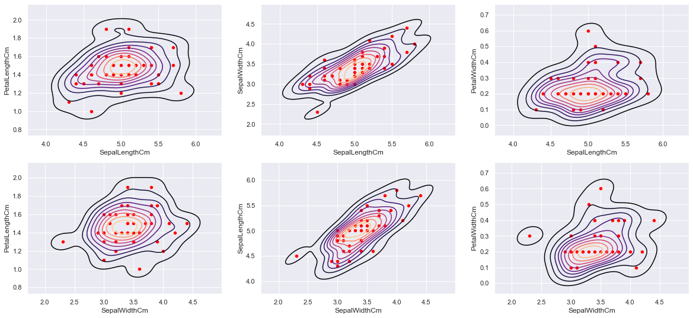

# iris dataset analysis and model
==================================

A task for the sparks foundation data sceince and analytics intern 
batch march 2022

Pre-requisites
--------------

- numpy
- pandas
- matplotlib
- seaborn

for data handling and preprocessing
- pandas
- sklearn.discriminant_analysis

Getting Started
---------------

## 1) EDa
Analizing  the data and preprocessing

## 2) Model

- Weston Watkins MC-SVM 
    from the repo : https://github.com/hazemMondy/weston-watkins-MCSVM

> performace :

> accuracy 99.3%

> the data labels

> the model predicition 

## 3) Report
a simple tableau story 
https://public.tableau.com/app/profile/hazem.mondy/viz/Irisdataset_16473417892530/Story1?publish=yes
